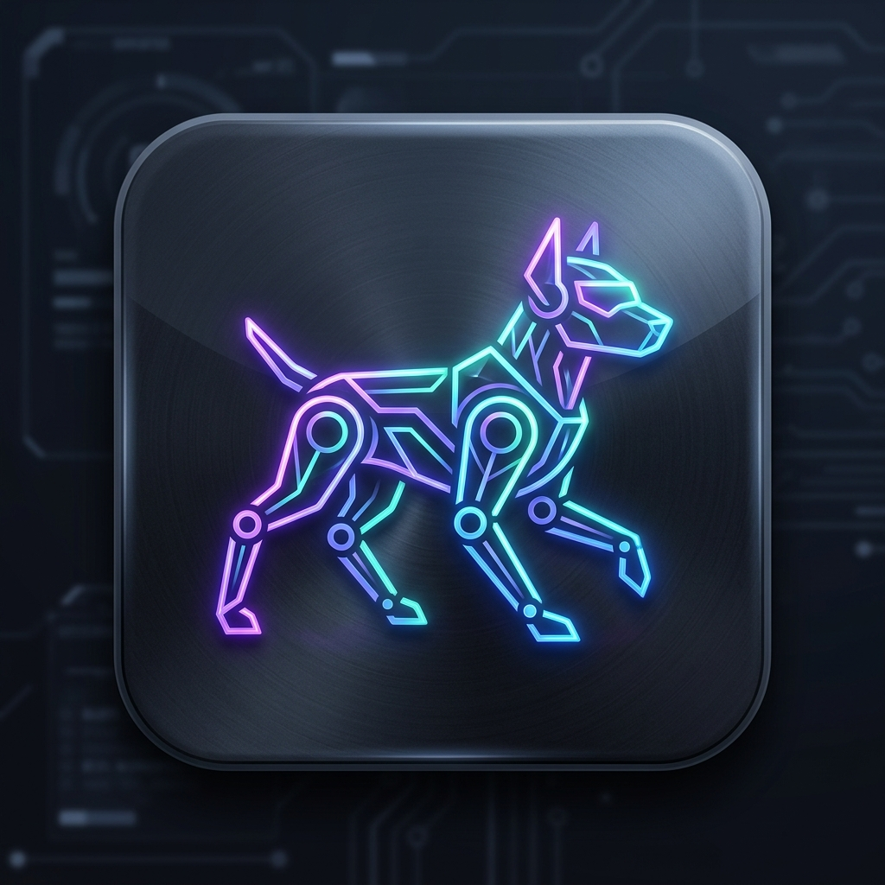

# QUADRUPED-App

  

A simple mobile controller for the 8-DOF quadruped robot. It connects over local WiFi (WebSocket) to an ESP32 and provides movement, calibration, head control, and settings.

## What it does

- Connects to the robot over WiFi (WebSocket)
- Sends real-time movement commands (D-pad + gait)
- Calibrates each servo channel
- Controls head rotation
- Adjusts timing and step settings

## Stack

  
  
  

- React Native (Expo)
- TypeScript
- Zustand
- WebSocket

## Quick Start

1. Install dependencies:
   
   `npm install`

2. Run the app:
   
   `npm start`

3. Open with Expo Go or an Android emulator.

## Build APK (Release)

Small APK (arm64 only):

`node build-apk.js`

Universal APK (all ABIs):

`node build-apk.js --universal`

Other options:

`node build-apk.js --abi armeabi-v7a`

`node build-apk.js --abis arm64-v8a,x86_64`

APKs are placed in `releases/`.

Note: builds are debug-signed unless you configure a release keystore.

## Screens & Controls

- Connect: enter ESP32 IP and connect/disconnect
- Control: D-pad + gait buttons for movement
- Calibration: per-servo slider tuning
- Head: head rotation control (CH8)
- Settings: gait timing, step height, preferences

## Reference Docs

- [docs/BUILD_INSTRUCTION.md](docs/BUILD_INSTRUCTION.md)
- [docs/PROJECT_INSTRUCTION.md](docs/PROJECT_INSTRUCTION.md)
- [docs/DESIGN_COMMANDS.md](docs/DESIGN_COMMANDS.md)
